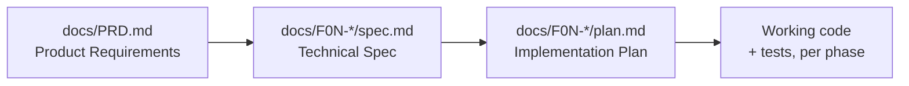

# Video Max

Video Max is a private video management platform for individual content creators who need a centralized place to store, organize, and review their video content. Users upload MP4 videos that are automatically transcribed by AI in the background; every transcript segment is clickable, jumping the player straight to that moment — no more scrubbing through hours of footage to find one line.

The platform combines three capabilities: a searchable, tagged video library; automatic AI transcription; and timestamp-linked navigation. It's built on **Next.js 14** (frontend), **Java 21 + Spring Boot 3.3 / Spring Modulith** (backend), **PostgreSQL 16** with **Liquibase**, and **AWS S3** for storage.

> **This entire project — product definition, technical specs, and code — is being built through an AI-driven, Spec Driven Development (SDD) workflow.** Every feature starts as a PRD entry, becomes a reviewed technical spec and implementation plan, and is only then implemented, in that order, by Claude Code agents operating under project-defined skills and rules. See [How this project is built](#how-this-project-is-built) below for the full pipeline.

## Table of Contents

- [How this project is built](#how-this-project-is-built)
  - [1. Product definition — PRD](#1-product-definition--prd)
  - [2. Technical specification — spec + plan](#2-technical-specification--spec--plan)
  - [3. Implementation](#3-implementation)
  - [Skills that drive the workflow](#skills-that-drive-the-workflow)
  - [Rules that constrain the code](#rules-that-constrain-the-code)
- [Product overview](#product-overview)
- [Architecture](#architecture)
- [Local development](#local-development)
- [Documentation map](#documentation-map)

## How this project is built

This repository is a working example of **Spec Driven Development with AI agents**: instead of prompting an assistant to "build feature X" directly, the workflow forces every feature through three explicit, reviewable artifacts before a single line of application code is written.



### 1. Product definition — PRD

[`docs/PRD.md`](docs/PRD.md) is the single source of truth for *what* Video Max does: executive summary, problem/opportunity, target audience, objectives, user stories, per-feature functionalities, out-of-scope items, a feature dependency graph with priorities and execution waves, and acceptance criteria for every feature (F01–F08). It was generated with the **`prd-writer`** skill and is the input to every downstream spec.

### 2. Technical specification — spec + plan

Each feature gets its own folder under `docs/` (e.g. [`docs/F01-authentication-system/`](docs/F01-authentication-system/)) containing:

- **`spec.md`** — technical overview, scope (included/excluded/deferred), architecture impact (file-by-file component tables for backend, frontend, and infrastructure), technical decisions with trade-offs, API contracts, data model with migrations, and a testing strategy that maps every PRD acceptance criterion to a concrete test.
- **`plan.md`** — a staged, numbered implementation plan derived from the spec, ready to be executed step by step.

These are produced by the **`spec-writer`** skill, which reads the PRD, analyzes the existing codebase, and applies this project's own skills and rules (Spring Modulith, Spring Security, database conventions, etc.) so the resulting spec is consistent with how the code is actually built here — not generic advice.

### 3. Implementation

Only once a spec and plan exist does code get written, via the **`implement-feature`** skill, which implements the feature phase-by-phase against its plan, commits one commit per phase, and reports results against the feature's acceptance criteria from the PRD — closing the loop back to the original requirements.

### Skills that drive the workflow

Skills are reusable, scoped instructions the agent loads for a given kind of work ([`.claude/skills/`](.claude/skills/)):

| Skill | Role in the workflow |
|---|---|
| `prd-writer` | Produces the PRD through iterative clarification |
| `spec-writer` | Turns a PRD feature into a technical spec + implementation plan |
| `implement-feature` | Executes a plan phase-by-phase, committing and reporting against acceptance criteria |
| `java-architect` | Java backend architecture — domain modeling, service boundaries, layering |
| `spring-boot-engineer` | Spring Boot 3.x implementation — controllers, DTOs, repositories, security |
| `java-spring-boot-best-practices` | Cross-cutting Spring Boot best practices review |
| `database-optimizer` / `postgres-pro` | Schema, query, index, and migration design and review |
| `test-master` | Test strategy, mocking, coverage analysis across unit/integration/E2E |

### Rules that constrain the code

Rules ([`.claude/rules/`](.claude/rules/)) are path-scoped conventions automatically applied whenever matching files are touched, so every spec and every implementation converges on the same architecture regardless of which agent or session produced it:

| Rule | Applies to | Enforces |
|---|---|---|
| `spring-modulith` | `**/*.java` | Modular monolith boundaries (`ApplicationModules.verify()`) |
| `spring-layer-separation` | `**/*.java` | Business logic only in services; controllers/repos stay thin |
| `spring-controllers` | `**/*Controller.java` | REST conventions, thin controllers, global exception handling |
| `spring-dtos` | `**/*.java` | Java Records for input validation and data transfer |
| `spring-entities` | `**/*.java` | Spring Data JDBC entity and repository conventions |
| `spring-security` | `**/config/SecurityConfig.java`, `**/security/**` | AuthN/AuthZ configuration conventions |
| `spring-configuration-observability` | `application.yml` | Externalized config + Actuator conventions |
| `spring-common-conventions` | `**/*.java` | General Spring Boot conventions |
| `spring-testing` | `src/test/java/**` | JUnit 5, Mockito, Testcontainers conventions |
| `liquibase-migrations` | `db/changelog/**` | Migration authoring and rollback conventions |

The result: the F01 spec explicitly documents that it "utilizes the local skills and rules defined in the project" — e.g. choosing Spring Data JDBC over JPA, Spring Modulith module boundaries, and BCrypt/JWT patterns — all traceable to the rules above rather than ad hoc choices.

## Product overview

Video Max targets creators who work with spoken-word content (tutorials, interviews, courses, vlogs) and need to locate specific moments in long recordings without scrubbing. The full feature set (see `docs/PRD.md` for details):

| # | Feature | Priority | Depends on |
|---|---|---|---|
| F01 | Authentication System | 1 | — |
| F02 | Video Upload | 1 | F01 |
| F03 | Background Processing (AI transcription) | 1 | F02 |
| F04 | Category Management | 2 | F01 |
| F05 | Tag Management | 2 | F01 |
| F06 | Video Library & Search | 1 | F01, F02, F04, F05 |
| F07 | Video Management | 1 | F01, F02, F04, F05 |
| F08 | Video Player with Transcription | 1 | F01, F02, F03 |

F01 is the **foundation feature**: it scaffolds the full-stack application (Next.js + Spring Boot + PostgreSQL + Liquibase) in addition to implementing the auth domain itself, so every later feature builds on an existing, agreed-upon skeleton instead of re-deciding project structure.

## Architecture

- **Frontend:** Next.js 14 (App Router), TypeScript, Tailwind CSS, shadcn/ui, React Hook Form + Zod
- **Backend:** Java 21, Spring Boot 3.3, Spring Modulith, Spring Data JDBC, Spring Security 6, Liquibase
- **Database:** PostgreSQL 16
- **Storage:** AWS S3 (video files, pre-signed URLs for playback)
- **Local email testing:** MailHog
- **Containerization:** Docker Compose for all services

## Local development

Full startup/teardown instructions, service URLs, and troubleshooting commands are documented in [`CLAUDE.md`](CLAUDE.md). Quick start:

```bash
docker compose up -d
docker compose exec -d spring-boot-app sh -c \
  'mvn spring-boot:run -Dspring-boot.run.profiles=dev > /tmp/app.log 2>&1'
```

| Service | URL |
|---|---|
| Frontend | http://localhost:3000 |
| Backend API | http://localhost:8080/api/v1 |
| MailHog | http://localhost:8025 |

## Documentation map

- [`docs/PRD.md`](docs/PRD.md) — product requirements, user stories, acceptance criteria
- [`docs/F01-authentication-system/spec.md`](docs/F01-authentication-system/spec.md) — F01 technical specification
- [`docs/F01-authentication-system/plan.md`](docs/F01-authentication-system/plan.md) — F01 implementation plan
- [`.claude/skills/`](.claude/skills/) — skills used across the PRD → spec → implementation pipeline
- [`.claude/rules/`](.claude/rules/) — path-scoped backend conventions enforced during implementation
- [`CLAUDE.md`](CLAUDE.md) — local environment, Docker networking, git and testing conventions
