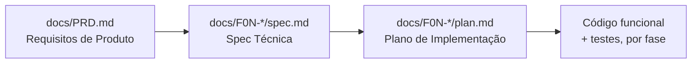

# Video Max

Video Max é uma plataforma privada de gestão de vídeos para criadores de conteúdo individuais que precisam de um local centralizado para armazenar, organizar e revisar seus vídeos. Os usuários enviam vídeos MP4 que são transcritos automaticamente por IA em segundo plano; cada trecho da transcrição é clicável, levando o player exatamente para aquele momento — sem precisar arrastar a barra de progresso por horas de gravação para encontrar uma fala.

A plataforma combina três capacidades: uma biblioteca de vídeos pesquisável e organizada por tags; transcrição automática via IA; e navegação vinculada a timestamps. Ela é construída com **Next.js 14** (frontend), **Java 21 + Spring Boot 3.3 / Spring Modulith** (backend), **PostgreSQL 16** com **Liquibase**, e **AWS S3** para armazenamento.

> **Todo este projeto — definição de produto, especificações técnicas e código — está sendo construído por meio de um workflow de Spec Driven Development (SDD) conduzido por IA.** Cada funcionalidade nasce como um item do PRD, vira uma especificação técnica e um plano de implementação revisados, e só então é implementada, nessa ordem, por agentes do Claude Code operando sob skills e rules definidas no projeto. Veja [Como este projeto é construído](#como-este-projeto-é-construído) abaixo para o pipeline completo.

## Sumário

- [Como este projeto é construído](#como-este-projeto-é-construído)
  - [1. Definição de produto — PRD](#1-definição-de-produto--prd)
  - [2. Especificação técnica — spec + plan](#2-especificação-técnica--spec--plan)
  - [3. Implementação](#3-implementação)
  - [Skills que conduzem o workflow](#skills-que-conduzem-o-workflow)
  - [Rules que restringem o código](#rules-que-restringem-o-código)
- [Visão geral do produto](#visão-geral-do-produto)
- [Arquitetura](#arquitetura)
- [Ambiente de desenvolvimento local](#ambiente-de-desenvolvimento-local)
- [Mapa da documentação](#mapa-da-documentação)

## Como este projeto é construído

Este repositório é um exemplo prático de **Spec Driven Development com agentes de IA**: em vez de simplesmente pedir a um assistente para "construir a funcionalidade X", o workflow força cada funcionalidade a passar por três artefatos explícitos e revisáveis antes que qualquer linha de código de aplicação seja escrita.



### 1. Definição de produto — PRD

[`docs/PRD.md`](docs/PRD.md) é a fonte única de verdade sobre *o que* o Video Max faz: resumo executivo, problema/oportunidade, público-alvo, objetivos, histórias de usuário, funcionalidades detalhadas por feature, itens fora de escopo, um grafo de dependências entre features com prioridades e ondas de execução, e critérios de aceitação para cada funcionalidade (F01–F08). Ele foi gerado com a skill **`prd-writer`** e é o insumo de toda spec técnica subsequente.

### 2. Especificação técnica — spec + plan

Cada funcionalidade tem sua própria pasta dentro de `docs/` (ex.: [`docs/F01-authentication-system/`](docs/F01-authentication-system/)) contendo:

- **`spec.md`** — visão técnica geral, escopo (incluído/excluído/adiado), impacto na arquitetura (tabelas de componentes arquivo a arquivo para backend, frontend e infraestrutura), decisões técnicas com trade-offs, contratos de API, modelo de dados com migrations, e uma estratégia de testes que mapeia cada critério de aceitação do PRD a um teste concreto.
- **`plan.md`** — um plano de implementação por estágios e numerado, derivado da spec, pronto para ser executado passo a passo.

Esses artefatos são produzidos pela skill **`spec-writer`**, que lê o PRD, analisa o código existente e aplica as próprias skills e rules do projeto (Spring Modulith, Spring Security, convenções de banco de dados, etc.), de forma que a spec resultante seja consistente com a forma como o código é de fato construído aqui — e não um conselho genérico.

### 3. Implementação

Somente depois que a spec e o plano existem é que o código é escrito, através da skill **`implement-feature`**, que implementa a funcionalidade fase a fase seguindo o plano, gera um commit por fase e reporta os resultados em relação aos critérios de aceitação da funcionalidade definidos no PRD — fechando o ciclo de volta aos requisitos originais.

### Skills que conduzem o workflow

Skills são instruções reutilizáveis e especializadas que o agente carrega para um determinado tipo de trabalho ([`.claude/skills/`](.claude/skills/)):

| Skill | Papel no workflow |
|---|---|
| `prd-writer` | Produz o PRD por meio de clarificação iterativa |
| `spec-writer` | Transforma uma feature do PRD em spec técnica + plano de implementação |
| `implement-feature` | Executa um plano fase a fase, commitando e reportando contra os critérios de aceitação |
| `java-architect` | Arquitetura backend Java — modelagem de domínio, limites de serviço, camadas |
| `spring-boot-engineer` | Implementação Spring Boot 3.x — controllers, DTOs, repositórios, segurança |
| `java-spring-boot-best-practices` | Revisão transversal de boas práticas Spring Boot |
| `database-optimizer` / `postgres-pro` | Design e revisão de schema, queries, índices e migrations |
| `test-master` | Estratégia de testes, mocks e análise de cobertura em unitário/integração/E2E |

### Rules que restringem o código

Rules ([`.claude/rules/`](.claude/rules/)) são convenções vinculadas a caminhos de arquivo, aplicadas automaticamente sempre que arquivos correspondentes são tocados, garantindo que toda spec e toda implementação convirjam para a mesma arquitetura, independentemente de qual agente ou sessão a produziu:

| Rule | Aplica-se a | Garante |
|---|---|---|
| `spring-modulith` | `**/*.java` | Limites do monólito modular (`ApplicationModules.verify()`) |
| `spring-layer-separation` | `**/*.java` | Lógica de negócio apenas em services; controllers/repos permanecem finos |
| `spring-controllers` | `**/*Controller.java` | Convenções REST, controllers finos, tratamento global de exceções |
| `spring-dtos` | `**/*.java` | Java Records para validação de entrada e transferência de dados |
| `spring-entities` | `**/*.java` | Convenções de entidades e repositórios Spring Data JDBC |
| `spring-security` | `**/config/SecurityConfig.java`, `**/security/**` | Convenções de configuração de autenticação/autorização |
| `spring-configuration-observability` | `application.yml` | Convenções de configuração externalizada + Actuator |
| `spring-common-conventions` | `**/*.java` | Convenções gerais do Spring Boot |
| `spring-testing` | `src/test/java/**` | Convenções de JUnit 5, Mockito e Testcontainers |
| `liquibase-migrations` | `db/changelog/**` | Convenções de escrita e rollback de migrations |

Resultado: a spec da F01 documenta explicitamente que "utiliza as skills locais e as rules definidas no projeto" — por exemplo, a escolha de Spring Data JDBC em vez de JPA, os limites de módulo do Spring Modulith e os padrões de BCrypt/JWT — todas rastreáveis às rules acima, e não decisões ad hoc.

## Visão geral do produto

O Video Max é voltado a criadores que trabalham com conteúdo falado (tutoriais, entrevistas, cursos, vlogs) e precisam localizar momentos específicos em gravações longas sem precisar arrastar a barra de vídeo. O conjunto completo de funcionalidades (veja `docs/PRD.md` para detalhes):

| # | Funcionalidade | Prioridade | Depende de |
|---|---|---|---|
| F01 | Sistema de Autenticação | 1 | — |
| F02 | Upload de Vídeo | 1 | F01 |
| F03 | Processamento em Background (transcrição por IA) | 1 | F02 |
| F04 | Gestão de Categorias | 2 | F01 |
| F05 | Gestão de Tags | 2 | F01 |
| F06 | Biblioteca de Vídeos e Busca | 1 | F01, F02, F04, F05 |
| F07 | Gestão de Vídeos | 1 | F01, F02, F04, F05 |
| F08 | Player de Vídeo com Transcrição | 1 | F01, F02, F03 |

A F01 é a **funcionalidade fundacional (foundation feature)**: além de implementar o domínio de autenticação em si, ela estrutura toda a aplicação full-stack (Next.js + Spring Boot + PostgreSQL + Liquibase), de forma que cada funcionalidade seguinte seja construída sobre um esqueleto já existente e acordado, em vez de redefinir a estrutura do projeto a cada vez.

## Arquitetura

- **Frontend:** Next.js 14 (App Router), TypeScript, Tailwind CSS, shadcn/ui, React Hook Form + Zod
- **Backend:** Java 21, Spring Boot 3.3, Spring Modulith, Spring Data JDBC, Spring Security 6, Liquibase
- **Banco de dados:** PostgreSQL 16
- **Armazenamento:** AWS S3 (arquivos de vídeo, URLs pré-assinadas para reprodução)
- **Teste de e-mail local:** MailHog
- **Containerização:** Docker Compose para todos os serviços

## Ambiente de desenvolvimento local

As instruções completas de subida/parada do ambiente, URLs dos serviços e comandos de troubleshooting estão documentadas em [`CLAUDE.md`](CLAUDE.md). Início rápido:

```bash
docker compose up -d
docker compose exec -d spring-boot-app sh -c \
  'mvn spring-boot:run -Dspring-boot.run.profiles=dev > /tmp/app.log 2>&1'
```

| Serviço | URL |
|---|---|
| Frontend | http://localhost:3000 |
| API Backend | http://localhost:8080/api/v1 |
| MailHog | http://localhost:8025 |

## Mapa da documentação

- [`docs/PRD.md`](docs/PRD.md) — requisitos de produto, histórias de usuário, critérios de aceitação
- [`docs/F01-authentication-system/spec.md`](docs/F01-authentication-system/spec.md) — especificação técnica da F01
- [`docs/F01-authentication-system/plan.md`](docs/F01-authentication-system/plan.md) — plano de implementação da F01
- [`.claude/skills/`](.claude/skills/) — skills usadas ao longo do pipeline PRD → spec → implementação
- [`.claude/rules/`](.claude/rules/) — convenções de backend vinculadas a caminhos, aplicadas durante a implementação
- [`CLAUDE.md`](CLAUDE.md) — ambiente local, rede Docker, convenções de git e testes
