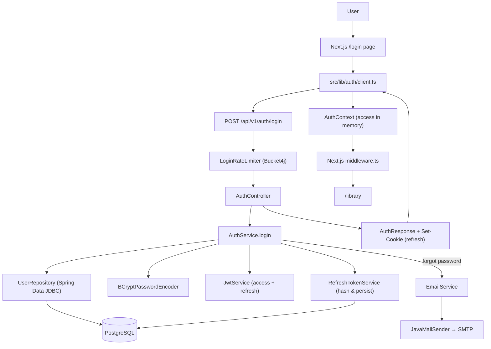

# F01. Authentication System — Technical Specification

**Complexity:** complex (Foundation feature — scaffolds full-stack app + auth domain)

---

## 1. Technical Overview

**What:** Establishes the full-stack Video Max application (backend `video-max-backend/` and frontend `video-max-frontend/`) and implements the authentication domain: email/password registration, login, JWT-based session with refresh rotation, password reset by email link, logout, and IP-based rate limiting on login.

**Why:** F01 is a Foundation feature per PRD Section 8. All subsequent features assume the backend project skeleton (Spring Boot 3.x + Spring Modulith + PostgreSQL + Liquibase + Spring Security 6), the frontend project skeleton (Next.js 14 App Router + TypeScript + Tailwind + shadcn/ui), and an authenticated user context are in place. Implementing them together avoids conflicting scaffolds between features in Wave 2.

**Scope:**
- **Included (backend):** Maven project, `application.yml` profiles (`dev`, `test`, `prod`), Liquibase changelogs, Spring Modulith `auth` module (entities, repositories, services, controller, DTOs, security filter chain, JWT service, refresh token service, password reset service, email service, login rate limiter), global `@RestControllerAdvice`, `ProblemDetail` error responses, `@ConfigurationProperties` for JWT and mail settings, integration and slice tests with Testcontainers.
- **Included (frontend):** Next.js App Router project, Tailwind + shadcn/ui setup, auth API client, React Hook Form + Zod form components, pages `/register`, `/login`, `/forgot-password`, `/reset-password`, `/library` (placeholder for F06), route protection via Next.js middleware, `AuthProvider` React context.
- **Included (infrastructure):** `docker-compose.yml` for local Postgres + MailHog, `.env.example` files for both apps.
- **Excluded:** OAuth/social login (deferred), email verification on registration (deferred), account settings/profile management (deferred), audit log of login attempts (out of scope for MVP), password strength meter beyond spec rules (nice-to-have), remember-me device management (deferred), CAPTCHA (deferred), MFA (out of scope).
- **Deferred (Full Scope additions from PRD):** None — the PRD's F01 does not declare Core/Full split, so the entire feature is Core scope.

---

## 2. Architecture Impact

**Backend components (`video-max-backend/`):**

| File Path | New/Modified | Purpose |
|-----------|--------------|---------|
| `pom.xml` | New | Maven project, Spring Boot 3.3.x, Java 21, dependencies |
| `src/main/java/com/videomax/backend/VideoMaxApplication.java` | New | Spring Boot entry point |
| `src/main/java/com/videomax/backend/config/SecurityConfig.java` | New | `SecurityFilterChain`, CORS, password encoder, method security |
| `src/main/java/com/videomax/backend/config/JwtProperties.java` | New | `@ConfigurationProperties` for JWT secret, issuer, access/refresh TTL |
| `src/main/java/com/videomax/backend/config/MailProperties.java` | New | `@ConfigurationProperties` for SMTP host/port/user/from |
| `src/main/java/com/videomax/backend/config/JwtAuthenticationFilter.java` | New | Reads `Authorization: Bearer` header, validates access token, populates `SecurityContext` |
| `src/main/java/com/videomax/backend/config/GlobalExceptionHandler.java` | New | `@RestControllerAdvice` mapping domain exceptions to `ProblemDetail` |
| `src/main/java/com/videomax/backend/config/RateLimitConfig.java` | New | Bucket4j + Caffeine bean for login IP throttling |
| `src/main/java/com/videomax/backend/auth/AuthController.java` | New | REST endpoints under `/api/v1/auth` |
| `src/main/java/com/videomax/backend/auth/dto/*.java` | New | Records: `RegisterRequest`, `LoginRequest`, `RefreshRequest`, `ForgotPasswordRequest`, `ResetPasswordRequest`, `AuthResponse`, `UserResponse` |
| `src/main/java/com/videomax/backend/auth/internal/AuthService.java` | New | Business logic for register / login / refresh / logout / forgot / reset |
| `src/main/java/com/videomax/backend/auth/internal/JwtService.java` | New | Issue and validate JWTs (access + refresh) |
| `src/main/java/com/videomax/backend/auth/internal/RefreshTokenService.java` | New | Persist hashed refresh tokens, rotate on refresh, revoke on logout |
| `src/main/java/com/videomax/backend/auth/internal/PasswordResetService.java` | New | Create/validate/consume password reset tokens |
| `src/main/java/com/videomax/backend/auth/internal/EmailService.java` | New | Send transactional email via `JavaMailSender` |
| `src/main/java/com/videomax/backend/auth/internal/LoginRateLimiter.java` | New | Bucket4j-backed per-IP throttling (5/15min) |
| `src/main/java/com/videomax/backend/auth/internal/entity/User.java` | New | Spring Data JDBC entity |
| `src/main/java/com/videomax/backend/auth/internal/entity/RefreshToken.java` | New | Spring Data JDBC entity |
| `src/main/java/com/videomax/backend/auth/internal/entity/PasswordResetToken.java` | New | Spring Data JDBC entity |
| `src/main/java/com/videomax/backend/auth/internal/repository/UserRepository.java` | New | `CrudRepository<User, UUID>` with `findByEmailIgnoreCase` |
| `src/main/java/com/videomax/backend/auth/internal/repository/RefreshTokenRepository.java` | New | Lookup by `tokenHash`, delete by `userId` |
| `src/main/java/com/videomax/backend/auth/internal/repository/PasswordResetTokenRepository.java` | New | Lookup by `tokenHash` |
| `src/main/java/com/videomax/backend/auth/internal/exception/*.java` | New | `EmailAlreadyRegisteredException`, `InvalidCredentialsException`, `InvalidResetTokenException`, `RateLimitExceededException`, `WeakPasswordException` |
| `src/main/resources/application.yml` | New | Base config, imports profile files |
| `src/main/resources/application-dev.yml` | New | Local dev config (Postgres via docker-compose, MailHog) |
| `src/main/resources/application-prod.yml` | New | Prod placeholders sourced from env vars |
| `src/main/resources/db/changelog/db.changelog-master.yaml` | New | Liquibase master file |
| `src/main/resources/db/changelog/001-create-users.yaml` | New | `users` table |
| `src/main/resources/db/changelog/002-create-refresh-tokens.yaml` | New | `refresh_tokens` table |
| `src/main/resources/db/changelog/003-create-password-reset-tokens.yaml` | New | `password_reset_tokens` table |
| `src/test/java/com/videomax/backend/auth/AuthControllerTest.java` | New | `@WebMvcTest` |
| `src/test/java/com/videomax/backend/auth/internal/AuthServiceTest.java` | New | `@ExtendWith(MockitoExtension.class)` unit test |
| `src/test/java/com/videomax/backend/auth/internal/JwtServiceTest.java` | New | Unit test |
| `src/test/java/com/videomax/backend/auth/AuthIntegrationTest.java` | New | `@SpringBootTest` + Testcontainers |
| `src/test/java/com/videomax/backend/auth/ModularityTest.java` | New | `ApplicationModules.of(...).verify()` |

**Frontend components (`video-max-frontend/`):**

| File Path | New/Modified | Purpose |
|-----------|--------------|---------|
| `package.json` | New | Next.js 14, TypeScript, Tailwind, shadcn, RHF, Zod |
| `next.config.js` | New | Base config, rewrites to backend in dev |
| `tailwind.config.ts` | New | Tailwind + shadcn theme tokens |
| `src/app/layout.tsx` | New | Root layout with `AuthProvider` |
| `src/app/page.tsx` | New | Landing that redirects to `/library` or `/login` |
| `src/app/(auth)/login/page.tsx` | New | Login form |
| `src/app/(auth)/register/page.tsx` | New | Register form |
| `src/app/(auth)/forgot-password/page.tsx` | New | Request reset |
| `src/app/(auth)/reset-password/page.tsx` | New | Set new password from token |
| `src/app/(app)/library/page.tsx` | New | Placeholder library page (to be replaced by F06) |
| `src/middleware.ts` | New | Route guard: redirect unauthenticated users to `/login` |
| `src/lib/auth/client.ts` | New | Fetch wrappers for auth endpoints, refresh-on-401 interceptor |
| `src/lib/auth/context.tsx` | New | React context: `useAuth()` with user + login/logout |
| `src/lib/auth/schemas.ts` | New | Zod schemas mirroring backend validation |
| `src/components/ui/*` | New | shadcn generated primitives (button, input, form, toast) |
| `src/components/auth/RegisterForm.tsx` | New | RHF + Zod form |
| `src/components/auth/LoginForm.tsx` | New | RHF + Zod form |
| `src/components/auth/ForgotPasswordForm.tsx` | New | RHF + Zod form |
| `src/components/auth/ResetPasswordForm.tsx` | New | RHF + Zod form |
| `src/components/layout/AppHeader.tsx` | New | Header with logout button |

**Infrastructure:**

| File Path | New/Modified | Purpose |
|-----------|--------------|---------|
| `docker-compose.yml` | New | Postgres 16 + MailHog for local dev |
| `.env.example` | New | Template of required env vars for both apps |

**Data flow diagram:**



---

## 3. Technical Decisions

| Decision | Chosen Approach | Alternative Considered | Trade-off |
|----------|-----------------|-----------------------|-----------|
| Persistence layer | Spring Data JDBC | Spring Data JPA / Hibernate | JDBC gives explicit control and simpler modularity per project rules, at the cost of no lazy loading and manual aggregate boundaries. |
| Password hashing | BCrypt (strength 12) | Argon2id | BCrypt is the Spring default and battle-tested. Argon2 is stronger against GPU but requires extra tuning; deferred to a future hardening pass. |
| JWT lifetime | Access 15 min + Refresh 7 d (hashed & persisted, rotated on refresh) | Single 7-day access token | Rotation enables revocation on logout and detection of stolen refresh tokens; more code but required by "session expires in 7 days" + revocable logout. |
| Refresh token transport | HTTP-only, Secure, SameSite=Lax cookie scoped to `/api/v1/auth/refresh` and `/api/v1/auth/logout` | Bearer token in `Authorization` header | Cookie is XSS-safe; scoped path limits CSRF surface. Access token still returned in JSON body for the SPA to hold in memory. |
| Rate limiting store | Bucket4j + Caffeine (in-process) | Bucket4j + Redis | In-process fits single-instance MVP without new infrastructure. When the backend scales horizontally, swap to Redis (the Bucket4j API is the same). |
| Modular layout | Spring Modulith with `auth` module; cross-cutting `config` and future modules siblings under `com.videomax.backend` | Flat package by layer (controller / service / repository) | Modulith enforces boundaries verified by `ApplicationModules.verify()`; small extra ceremony pays off as F02–F08 add more modules. |
| Frontend auth transport | Refresh in HTTP-only cookie, Access in module-scoped memory | Both tokens in localStorage / both in cookies | Best XSS posture. Trade-off: access token is lost on hard refresh — client mitigates by silently calling `/refresh` on app boot when the refresh cookie is present. |
| API error format | RFC 7807 `ProblemDetail` (Spring Boot 3 native) | Custom envelope (`{ status, code, message }`) | `ProblemDetail` is a standard, works with `@RestControllerAdvice`, and is the direction the framework moved to in 3.x. |
| Email delivery | `JavaMailSender` + configurable SMTP (dev: MailHog; prod: env-configured provider) | AWS SES SDK directly | JavaMailSender abstracts the provider — any SMTP-speaking service (SES, Mailgun, SendGrid) works via env vars, avoiding lock-in. |

---

## 4. Component Overview

### Backend layer (Spring Modulith `auth` module)

**Public API surface (`com.videomax.backend.auth`):**

| Class | Purpose | Key Responsibilities |
|-------|---------|----------------------|
| `AuthController` | HTTP entry point for `/api/v1/auth/**` | Bind requests to DTOs, invoke `AuthService`, set/clear refresh cookie, delegate errors to advice |
| `dto/RegisterRequest` | Registration payload (record) | `@NotBlank name`, `@Email email`, `@ValidPassword password` |
| `dto/LoginRequest` | Login payload (record) | `@Email email`, `@NotBlank password` |
| `dto/RefreshRequest` | Explicit refresh (rare, cookie is primary) | Optional `refreshToken` |
| `dto/ForgotPasswordRequest` | Reset request (record) | `@Email email` |
| `dto/ResetPasswordRequest` | New password submission (record) | `@NotBlank token`, `@ValidPassword newPassword` |
| `dto/AuthResponse` | Successful auth response (record) | `accessToken`, `expiresIn`, `user` (nested `UserResponse`) |
| `dto/UserResponse` | User public view (record) | `id`, `email`, `name`, `createdAt` |

**Internal (`com.videomax.backend.auth.internal`):**

| Class | Purpose | Key Responsibilities |
|-------|---------|----------------------|
| `AuthService` | Orchestrates auth use cases | `register`, `login`, `refresh`, `logout`, `forgotPassword`, `resetPassword` — coordinates encoder, JWT, refresh store, rate limiter, email |
| `JwtService` | JWT signing and parsing | Sign HS256 access token (15 min) and refresh token (7 d); parse and validate; expose `getUserId(token)` |
| `RefreshTokenService` | Refresh token lifecycle | Generate opaque secret; hash with SHA-256; persist; rotate on `/refresh`; revoke on logout; cleanup expired |
| `PasswordResetService` | Password reset flow | Generate reset token (30 min TTL), persist hash, validate & mark `consumedAt` |
| `EmailService` | Transactional email | Render templates for reset email; deliver via `JavaMailSender` |
| `LoginRateLimiter` | IP-based throttle | Bucket4j bucket per IP: 5 tokens per 15 min sliding window; expose `tryConsume(ip)` |
| `entity/User` | Spring Data JDBC entity | `@Table("users")` — id, email, passwordHash, name, createdAt, updatedAt |
| `entity/RefreshToken` | Spring Data JDBC entity | `@Table("refresh_tokens")` — id, userId (`AggregateReference<User, UUID>`), tokenHash, expiresAt, revokedAt, createdAt |
| `entity/PasswordResetToken` | Spring Data JDBC entity | `@Table("password_reset_tokens")` — id, userId, tokenHash, expiresAt, consumedAt, createdAt |
| `repository/UserRepository` | `CrudRepository<User, UUID>` | `findByEmailIgnoreCase(String)`, `existsByEmailIgnoreCase(String)` |
| `repository/RefreshTokenRepository` | `CrudRepository<RefreshToken, UUID>` | `findByTokenHash(String)`, `deleteAllByUserId(UUID)` |
| `repository/PasswordResetTokenRepository` | `CrudRepository<PasswordResetToken, UUID>` | `findByTokenHash(String)` |
| `exception/*` | Domain exceptions | Mapped by advice to specific HTTP statuses |

**Cross-cutting (`com.videomax.backend.config`):**

| Class | Purpose | Key Responsibilities |
|-------|---------|----------------------|
| `SecurityConfig` | Filter chain | Permit `/api/v1/auth/register`, `/login`, `/refresh`, `/forgot-password`, `/reset-password`, `/actuator/health`; require auth elsewhere; register CORS; wire `JwtAuthenticationFilter`; disable CSRF (stateless) |
| `JwtAuthenticationFilter` | Access-token filter | On each request, parse `Authorization: Bearer`, validate via `JwtService`, populate `SecurityContext` |
| `GlobalExceptionHandler` | `@RestControllerAdvice` | Map domain exceptions and `MethodArgumentNotValidException` to `ProblemDetail` |
| `RateLimitConfig` | Beans for rate limiter | Caffeine cache + Bucket4j `ProxyManager` |
| `JwtProperties` | `@ConfigurationProperties("app.jwt")` | `secret`, `issuer`, `accessTtl`, `refreshTtl` |
| `MailProperties` | `@ConfigurationProperties("app.mail")` | `fromAddress`, `resetLinkBase` |

### Frontend layer

| File | Purpose | Key Responsibilities |
|------|---------|----------------------|
| `src/lib/auth/client.ts` | HTTP client | Wrap `fetch` for register/login/refresh/logout/forgot/reset; auto-refresh access token on 401; base URL from `NEXT_PUBLIC_API_BASE` |
| `src/lib/auth/context.tsx` | React context | Provide `{ user, accessToken, login, logout, refresh }`; boot-time silent refresh |
| `src/lib/auth/schemas.ts` | Zod schemas | Mirror backend validation: email format, password complexity (>= 8, uppercase, digit) |
| `src/middleware.ts` | Next.js middleware | On protected routes (`/library`, future `/videos/*`, etc.), check refresh cookie presence — redirect to `/login` if absent |
| `src/components/auth/RegisterForm.tsx` | Registration UI | RHF + Zod; display field errors and generic API errors as toast |
| `src/components/auth/LoginForm.tsx` | Login UI | RHF + Zod; render "Invalid email or password" for backend 401 |
| `src/components/auth/ForgotPasswordForm.tsx` | Reset request UI | RHF + Zod; always show success toast regardless of email existence (prevent enumeration) |
| `src/components/auth/ResetPasswordForm.tsx` | New password UI | Reads `token` from query string; posts to backend |
| `src/components/layout/AppHeader.tsx` | App shell header | Renders user name, logout button |

### Database layer (Liquibase changelogs)

| Migration File | Tables Affected | Operation | Notes |
|----------------|-----------------|-----------|-------|
| `db/changelog/001-create-users.yaml` | `users` | CREATE | Primary key UUID; unique index on lowercased email |
| `db/changelog/002-create-refresh-tokens.yaml` | `refresh_tokens` | CREATE | FK to `users.id`; index on `token_hash` and `user_id` |
| `db/changelog/003-create-password-reset-tokens.yaml` | `password_reset_tokens` | CREATE | FK to `users.id`; index on `token_hash`; `expires_at` index for cleanup |

---

## 5. API Contracts

All endpoints live under the base path `/api/v1/auth`. Errors use `application/problem+json` per RFC 7807.

### Endpoint: Register

- **Method:** POST
- **Path:** `/api/v1/auth/register`
- **Authentication:** Public

**Request:**

| Field | Type | Required | Validation | Description |
|-------|------|----------|------------|-------------|
| `name` | `string` | Yes | 1–100 chars | Display name |
| `email` | `string` | Yes | valid email, ≤ 255 chars | Login identifier |
| `password` | `string` | Yes | 8–72 chars, ≥1 uppercase, ≥1 digit | Raw password |

**Request Example:**

```json
{
  "name": "Alex Creator",
  "email": "alex@example.com",
  "password": "StrongPass1"
}
```

**Response (201 Created):**

| Field | Type | Description |
|-------|------|-------------|
| `accessToken` | `string` | Signed JWT (HS256) |
| `expiresIn` | `integer` | Seconds until access token expires (900) |
| `user.id` | `uuid` | Created user id |
| `user.email` | `string` | Email |
| `user.name` | `string` | Name |
| `user.createdAt` | `timestamptz` | Creation time |

Server also sets `Set-Cookie: refresh_token=<opaque>; HttpOnly; Secure; SameSite=Lax; Path=/api/v1/auth; Max-Age=604800`.

**Response Example:**

```json
{
  "accessToken": "eyJhbGciOiJIUzI1NiJ9...",
  "expiresIn": 900,
  "user": {
    "id": "3c5c0b0e-2b3a-4b30-97d5-cb4ffc0f7091",
    "email": "alex@example.com",
    "name": "Alex Creator",
    "createdAt": "2026-07-03T12:00:00Z"
  }
}
```

**Error Codes:**

| Code | HTTP Status | Description |
|------|-------------|-------------|
| `AUTH_EMAIL_TAKEN` | 409 | Email already registered |
| `AUTH_WEAK_PASSWORD` | 400 | Password does not meet complexity |
| `AUTH_VALIDATION_FAILED` | 400 | Bean Validation field errors |

### Endpoint: Login

- **Method:** POST
- **Path:** `/api/v1/auth/login`
- **Authentication:** Public (rate-limited by IP)

**Request:**

| Field | Type | Required | Validation | Description |
|-------|------|----------|------------|-------------|
| `email` | `string` | Yes | valid email | Login identifier |
| `password` | `string` | Yes | non-blank | Raw password |

**Request Example:**

```json
{ "email": "alex@example.com", "password": "StrongPass1" }
```

**Response (200 OK):** Same shape as Register (with refresh cookie set).

**Error Codes:**

| Code | HTTP Status | Description |
|------|-------------|-------------|
| `AUTH_INVALID_CREDENTIALS` | 401 | Wrong email or password (generic message) |
| `AUTH_RATE_LIMIT_EXCEEDED` | 429 | > 5 login attempts from this IP in 15 min |

### Endpoint: Refresh

- **Method:** POST
- **Path:** `/api/v1/auth/refresh`
- **Authentication:** Refresh cookie required

**Request:** No body. Reads `refresh_token` cookie.

**Response (200 OK):** Same shape as Login/Register. A new refresh cookie is set (rotation); the previous one is revoked in DB.

**Error Codes:**

| Code | HTTP Status | Description |
|------|-------------|-------------|
| `AUTH_INVALID_REFRESH` | 401 | Missing / expired / revoked / unknown refresh token — all mapped to same code |

### Endpoint: Logout

- **Method:** POST
- **Path:** `/api/v1/auth/logout`
- **Authentication:** Refresh cookie required

**Response (204 No Content).** Server revokes the current refresh token in DB and returns `Set-Cookie: refresh_token=; Max-Age=0`.

### Endpoint: Forgot Password

- **Method:** POST
- **Path:** `/api/v1/auth/forgot-password`
- **Authentication:** Public

**Request:**

| Field | Type | Required | Validation | Description |
|-------|------|----------|------------|-------------|
| `email` | `string` | Yes | valid email | Email of the account to reset |

**Response (202 Accepted):** Empty body. Response is identical whether the email exists or not (prevents enumeration). When the email exists, a reset email with a link to `${app.mail.reset-link-base}?token=<opaque>` is sent asynchronously.

### Endpoint: Reset Password

- **Method:** POST
- **Path:** `/api/v1/auth/reset-password`
- **Authentication:** Public

**Request:**

| Field | Type | Required | Validation | Description |
|-------|------|----------|------------|-------------|
| `token` | `string` | Yes | non-blank | Opaque token from the reset email |
| `newPassword` | `string` | Yes | 8–72 chars, ≥1 uppercase, ≥1 digit | New password |

**Response (204 No Content).** All active refresh tokens for the user are revoked.

**Error Codes:**

| Code | HTTP Status | Description |
|------|-------------|-------------|
| `AUTH_INVALID_RESET_TOKEN` | 400 | Token expired, already consumed, or unknown |
| `AUTH_WEAK_PASSWORD` | 400 | New password does not meet complexity |

### Endpoint: Current user

- **Method:** GET
- **Path:** `/api/v1/auth/me`
- **Authentication:** Access token (Bearer)

**Response (200 OK):** `UserResponse` shape.

**Error Codes:** Standard 401 when access token missing/invalid (handled by filter → advice).

---

## 6. Data Model

Cross-database notes: types use PostgreSQL. UUID default `gen_random_uuid()` (pgcrypto extension is enabled by the first changelog).

### Table: `users`

| Column | Type | Nullable | Default | Description |
|--------|------|----------|---------|-------------|
| `id` | `uuid` | No | `gen_random_uuid()` | Primary key |
| `email` | `varchar(255)` | No | — | Case-preserving storage; uniqueness is case-insensitive (see index) |
| `password_hash` | `varchar(72)` | No | — | BCrypt hash |
| `name` | `varchar(100)` | No | — | Display name |
| `created_at` | `timestamptz` | No | `now()` | Row creation |
| `updated_at` | `timestamptz` | No | `now()` | Updated by trigger or service |

**Indexes:**

| Index Name | Columns | Type | Purpose |
|------------|---------|------|---------|
| `ux_users_email_lower` | `lower(email)` | btree UNIQUE | Case-insensitive unique lookup by email |

**Constraints:**

| Constraint | Type | Definition | Purpose |
|------------|------|------------|---------|
| `pk_users` | PRIMARY KEY | `id` | Unique identifier |
| `ck_users_email_format` | CHECK | `email ~* '^[^@\s]+@[^@\s]+\.[^@\s]+$'` | Cheap sanity check (main validation is Bean Validation) |

### Table: `refresh_tokens`

| Column | Type | Nullable | Default | Description |
|--------|------|----------|---------|-------------|
| `id` | `uuid` | No | `gen_random_uuid()` | Primary key |
| `user_id` | `uuid` | No | — | FK → `users.id` |
| `token_hash` | `varchar(64)` | No | — | SHA-256 hex of raw token (raw is never stored) |
| `expires_at` | `timestamptz` | No | — | Absolute expiry (issue time + 7 d) |
| `revoked_at` | `timestamptz` | Yes | `NULL` | Set on logout or rotation |
| `created_at` | `timestamptz` | No | `now()` | Row creation |

**Indexes:**

| Index Name | Columns | Type | Purpose |
|------------|---------|------|---------|
| `ux_refresh_tokens_token_hash` | `token_hash` | btree UNIQUE | O(1) lookup during `/refresh` |
| `ix_refresh_tokens_user_id` | `user_id` | btree | Bulk revoke by user (password reset, logout-everywhere) |
| `ix_refresh_tokens_expires_at` | `expires_at` | btree | Periodic cleanup job |

**Constraints:**

| Constraint | Type | Definition | Purpose |
|------------|------|------------|---------|
| `pk_refresh_tokens` | PRIMARY KEY | `id` | Unique identifier |
| `fk_refresh_tokens_user` | FOREIGN KEY | `user_id REFERENCES users(id) ON DELETE CASCADE` | Cascade user deletion |

### Table: `password_reset_tokens`

| Column | Type | Nullable | Default | Description |
|--------|------|----------|---------|-------------|
| `id` | `uuid` | No | `gen_random_uuid()` | Primary key |
| `user_id` | `uuid` | No | — | FK → `users.id` |
| `token_hash` | `varchar(64)` | No | — | SHA-256 hex of raw token |
| `expires_at` | `timestamptz` | No | — | Issue time + 30 min |
| `consumed_at` | `timestamptz` | Yes | `NULL` | Set when the token is used |
| `created_at` | `timestamptz` | No | `now()` | Row creation |

**Indexes:**

| Index Name | Columns | Type | Purpose |
|------------|---------|------|---------|
| `ux_password_reset_tokens_hash` | `token_hash` | btree UNIQUE | O(1) lookup |
| `ix_password_reset_tokens_user_id` | `user_id` | btree | Invalidate all pending resets when a new one is issued |

**Constraints:**

| Constraint | Type | Definition | Purpose |
|------------|------|------------|---------|
| `pk_password_reset_tokens` | PRIMARY KEY | `id` | Unique identifier |
| `fk_password_reset_tokens_user` | FOREIGN KEY | `user_id REFERENCES users(id) ON DELETE CASCADE` | Cascade user deletion |

### Migration examples

`db/changelog/001-create-users.yaml`:

```yaml
databaseChangeLog:
  - changeSet:
      id: 001-enable-pgcrypto
      author: IA
      changes:
        - sql:
            sql: CREATE EXTENSION IF NOT EXISTS pgcrypto;
      rollback: []
  - changeSet:
      id: 001-create-users
      author: IA
      changes:
        - createTable:
            tableName: users
            columns:
              - column: { name: id, type: UUID, defaultValueComputed: gen_random_uuid(), constraints: { primaryKey: true, nullable: false } }
              - column: { name: email, type: VARCHAR(255), constraints: { nullable: false } }
              - column: { name: password_hash, type: VARCHAR(72), constraints: { nullable: false } }
              - column: { name: name, type: VARCHAR(100), constraints: { nullable: false } }
              - column: { name: created_at, type: TIMESTAMPTZ, defaultValueComputed: now(), constraints: { nullable: false } }
              - column: { name: updated_at, type: TIMESTAMPTZ, defaultValueComputed: now(), constraints: { nullable: false } }
        - sql:
            sql: CREATE UNIQUE INDEX ux_users_email_lower ON users (LOWER(email));
      rollback:
        - dropTable: { tableName: users }
```

The remaining changelogs (`002-*`, `003-*`) follow the same style: `createTable`, `addForeignKeyConstraint`, `createIndex`, and full `rollback` blocks.

---

## 7. Testing Strategy

### Backend

| Test File | Test Type | Target | Coverage Goal |
|-----------|-----------|--------|---------------|
| `com/videomax/backend/auth/internal/AuthServiceTest.java` | Unit (Mockito) | `AuthService` | 90% |
| `com/videomax/backend/auth/internal/JwtServiceTest.java` | Unit | `JwtService` | 90% |
| `com/videomax/backend/auth/internal/RefreshTokenServiceTest.java` | Unit | `RefreshTokenService` | 90% |
| `com/videomax/backend/auth/internal/PasswordResetServiceTest.java` | Unit | `PasswordResetService` | 90% |
| `com/videomax/backend/auth/internal/LoginRateLimiterTest.java` | Unit | `LoginRateLimiter` | 100% |
| `com/videomax/backend/auth/AuthControllerTest.java` | Slice (`@WebMvcTest`) | HTTP contracts, validation, exception mapping | 85% |
| `com/videomax/backend/auth/AuthIntegrationTest.java` | Integration (`@SpringBootTest` + Testcontainers Postgres + GreenMail) | End-to-end flows: register → login → refresh → logout, forgot → reset, rate limiting | 80% |
| `com/videomax/backend/ModularityTest.java` | Modulith | `ApplicationModules.of(VideoMaxApplication.class).verify()` | pass |

**Unit test — `AuthServiceTest`:**

| Test Function | Description | Assertions |
|---------------|-------------|------------|
| `register_newEmail_persistsUserAndIssuesTokens` | Happy path | `UserRepository.save` called with BCrypt hash; `AuthResponse` returns 15-min access token and refresh cookie value |
| `register_duplicateEmail_throwsEmailAlreadyRegistered` | Duplicate detection | Throws `EmailAlreadyRegisteredException`; nothing saved |
| `register_weakPassword_throwsWeakPassword` | Complexity check | Throws `WeakPasswordException` |
| `login_correctCredentials_returnsTokens` | Happy path | Returns `AuthResponse`; refresh token persisted with hash |
| `login_wrongPassword_throwsInvalidCredentials` | Wrong password | Throws `InvalidCredentialsException`; message is generic |
| `login_unknownEmail_throwsInvalidCredentials` | Enumeration guard | Same exception as wrong password |
| `login_rateLimitTriggered_throwsRateLimitExceeded` | Bucket empty | Rate limiter consumed 5 tokens; 6th call throws |
| `refresh_validToken_rotatesRefresh` | Rotation | Old token marked `revokedAt`; new token persisted |
| `refresh_revokedToken_throwsInvalidRefresh` | Reuse detection | Old (revoked) token → 401 |
| `logout_revokesRefreshToken` | Logout | `revokedAt` set on the row for the presented token |
| `forgotPassword_existingUser_sendsEmail` | Happy path | `EmailService.sendReset` invoked; token persisted |
| `forgotPassword_unknownEmail_silentlyDoesNothing` | Enumeration guard | No exception, no persistence, no email |
| `resetPassword_validToken_updatesPasswordAndRevokesRefreshTokens` | Happy path | New BCrypt hash saved; all refresh tokens for user marked revoked; token marked consumed |
| `resetPassword_expiredToken_throwsInvalidResetToken` | Expiry | Throws `InvalidResetTokenException` |
| `resetPassword_reusedToken_throwsInvalidResetToken` | Reuse | Same exception as expired |

**Slice test — `AuthControllerTest` (@WebMvcTest, mock `AuthService`):**

| Test Function | Description | Assertions |
|---------------|-------------|------------|
| `register_returns201WithBodyAndCookie` | 201 on happy path | JSON body + `Set-Cookie: refresh_token=...` with correct attributes |
| `register_missingEmail_returns400ValidationDetail` | Bean Validation | `ProblemDetail` lists `email` field error |
| `register_duplicateEmail_returns409` | Advice mapping | Body `type` includes `AUTH_EMAIL_TAKEN` |
| `login_wrongCredentials_returns401Generic` | Advice mapping | Body message does NOT reveal whether email or password was wrong |
| `login_rateLimited_returns429` | Advice mapping | Response 429 with `AUTH_RATE_LIMIT_EXCEEDED` |
| `refresh_missingCookie_returns401` | Cookie required | 401 |
| `refresh_valid_returnsNewToken` | Happy path | 200 + rotated cookie |
| `logout_returns204AndClearsCookie` | Cookie cleared | `Set-Cookie: refresh_token=; Max-Age=0` |
| `forgotPassword_alwaysReturns202` | Enumeration guard | 202 whether service invoked email or not |
| `resetPassword_invalidToken_returns400` | Advice mapping | `AUTH_INVALID_RESET_TOKEN` |
| `me_withoutBearer_returns401` | Filter chain | 401 |

**Integration test — `AuthIntegrationTest`:**

| Test Function | Description | Assertions |
|---------------|-------------|------------|
| `registerLoginRefreshLogout_endToEnd` | Full happy path via `TestRestTemplate` | 201, then 200 login, then 200 refresh, then 204 logout; DB rows verified |
| `refreshAfterLogout_returns401` | Revocation works | 401 |
| `rateLimit_after5FailedLogins_returns429` | Bucket4j behavior | 6th call within 15 min → 429 |
| `forgotPassword_sendsEmailToGreenMail` | Email delivery | GreenMail server receives message; link contains a valid token |
| `resetPassword_validToken_setsNewPasswordAndRevokesRefresh` | Cascading revocation | Old refresh token → 401 after reset |

### Frontend

| Test File | Test Type | Target | Coverage Goal |
|-----------|-----------|--------|---------------|
| `src/lib/auth/client.test.ts` | Unit (Vitest + MSW) | HTTP client, 401 refresh interceptor | 85% |
| `src/lib/auth/schemas.test.ts` | Unit (Vitest) | Zod schemas match backend rules | 100% |
| `src/components/auth/LoginForm.test.tsx` | Component (React Testing Library) | Form errors, submit, generic 401 message | 80% |
| `src/components/auth/RegisterForm.test.tsx` | Component (RTL) | Field validation, success redirect | 80% |
| `src/middleware.test.ts` | Unit (Vitest) | Redirects unauthenticated requests | 100% |

Each frontend test set mirrors the backend contract to ensure the two projects agree on validation and response shape.

### Acceptance criteria mapping (PRD Section 9)

Every acceptance criterion in PRD Section 9 for F01 maps to at least one integration test:

- User can register with valid email + password → `registerLoginRefreshLogout_endToEnd`
- Registration fails with "email already exists" → `register_duplicateEmail_returns409`
- User can log in with correct credentials → `registerLoginRefreshLogout_endToEnd`
- Login fails with generic error → `login_wrongCredentials_returns401Generic`
- Password reset email sent within 2 min, 30-min expiry → `forgotPassword_sendsEmailToGreenMail` + `resetPassword_expiredToken_throwsInvalidResetToken`
- 5 failed attempts / 15 min lockout → `rateLimit_after5FailedLogins_returns429`

### Cross-feature integration (PRD Section 9)

F01 has no `Consumes` block — it is the root of the dependency graph. It therefore contributes no criteria to the Cross-Feature Integration block. However, F01 is the infrastructure provider for every future feature: F02–F08 will consume the authenticated user context established here (`SecurityContext.getAuthentication().getPrincipal()` maps to a `User.id`). This is validated implicitly by every future feature's integration test having to acquire a valid access token from F01's login endpoint.

---

## Assumptions and Decisions Log

Recorded here so the user can review defaults chosen during the interview:

1. Monorepo layout: `video-max-backend/` + `video-max-frontend/` at project root. Rules referencing `stream-tube-backend/` (template legacy) will be updated to match.
2. JWT: HS256 with a 256-bit secret from env (`APP_JWT_SECRET`); asymmetric RS256 deferred until multi-service split.
3. Refresh rotation policy: on every `/refresh`, the presented refresh token is marked `revokedAt` and a new one is issued. Reuse of a revoked token is treated as a stolen credential and could later trigger revoking all sessions for the user (out of MVP scope; implement in a future security pass).
4. Password reset link base URL is configured via `app.mail.reset-link-base` and points to the frontend (`https://.../reset-password?token=...`). In dev it defaults to `http://localhost:3000/reset-password`.
5. Login rate limit key is `remoteAddr`. Behind a load balancer this must be replaced with the trusted `X-Forwarded-For` first hop; the config exposes a toggle `app.rate-limit.trust-proxy`.
6. `POST /forgot-password` returns 202 regardless of whether the email exists to prevent enumeration; the actual email send is best-effort (logged on failure, not retried in MVP).
7. No email verification on registration — user is authenticated immediately.
8. `users.email` is stored case-preserving; uniqueness and lookups use `LOWER(email)`. This matches the case-insensitive rule in PRD Section 6 and works for future features that also treat email as case-insensitive.
9. Frontend `/library` page is a minimal placeholder in F01 (empty state + logout header). F06 will replace its contents. Its route protection wiring (middleware + `AuthProvider`) is F01's responsibility because F06 assumes it exists.
