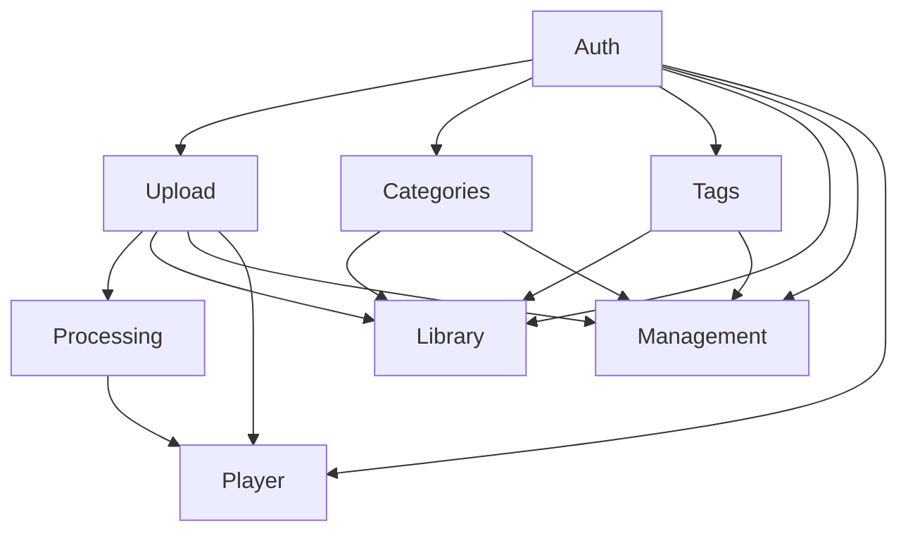

# Video Max

## 1. Executive Summary

Video Max is a private video management platform designed for individual content creators who need a centralized space to store, organize, and review their video content. The platform combines video hosting with AI-powered automatic transcription, allowing creators to navigate their content precisely by clicking any transcript segment to jump directly to that point in the video.

Users upload MP4 videos that are automatically processed in the background — generating text transcriptions linked to timestamps. A flexible organization system based on user-defined categories and tags allows creators to build a structured library that can be searched and filtered by title, category, or tag. All content remains private and accessible only to the authenticated owner.

Video Max targets creators who work with spoken-word content — tutorials, interviews, courses, vlogs — and need to efficiently review and locate specific moments within their recordings without scrubbing through hours of footage. The platform is built on Next.js (frontend), Java Spring Boot (backend), PostgreSQL, and AWS S3.

## 2. Problem and Opportunity

**Difficult navigation within long videos**
- Creators waste significant time scrubbing through recordings to locate specific moments
- No quick way to jump to a particular topic without external notes or manual timecodes
- Rewatching entire videos to find usable segments is a recurring pain point for active creators

**Disorganized video libraries**
- Files stored locally or across multiple platforms with no unified naming convention
- No consistent metadata (description, topic, tags) makes retrieval increasingly difficult as the library grows
- Searching by filename alone fails when the collection exceeds a few dozen videos

**Lack of accessible transcription tooling**
- Professional transcription services are expensive and add turnaround delay
- Manual transcription is time-consuming and error-prone
- Most creators have no way to search the spoken content of their own videos

**The Opportunity**

Video Max addresses these problems by combining three capabilities in one platform:
- Upload + organized library → replaces scattered file storage with a searchable, tagged collection
- Automatic AI transcription → eliminates manual effort and unlocks content-level navigation
- Timestamp-linked transcript → removes the need to scrub, enabling precise content review in seconds

The combination targets a gap in the market: professional tools are too expensive; consumer tools lack transcript-based navigation; file systems offer no metadata or search.

## 3. Target Audience

### Primary Users

**Individual Content Creator**
- Produces MP4 video content regularly (tutorials, vlogs, interviews, online courses) and maintains a personal library of 10–200+ recordings
- Reviews their own footage frequently to extract clips, reference past content, or repurpose material for new projects
- Works alone and owns the video library personally; needs speed of retrieval over advanced editing or collaboration features

## 4. Objectives

**Build a reliable upload and storage pipeline**
- 95% of uploads complete without error under normal network conditions
- Uploaded video available for playback within 5 minutes of upload completion

**Deliver accurate automatic transcription**
- Transcription generated automatically for 100% of uploaded videos within 10 minutes for videos up to 1 hour
- Timestamp accuracy within ±1 second per segment

**Enable efficient video organization**
- Users can assign categories and tags to any video within 2 clicks from the library
- Search returns relevant results in under 500ms for libraries up to 500 videos

**Provide fast content navigation via transcription**
- Users can jump to any transcription segment with a single click, with no delay beyond normal playback latency

**Retain active users through core value delivery**
- 70% of users who complete their first upload return within 7 days to upload a second video

## 5. User Stories

### F01. Authentication System
- As a user, I want to register with my email and password so that I can create a personal account
- As a user, I want to log in with my email and password so that I can access my video library
- As a user, I want to reset my password via email so that I can recover access to my account
- As a user, I want to log out so that my account is protected on shared devices

### F02. Video Upload
- As a user, I want to select an MP4 file from my device so that I can add it to my library
- As a user, I want to see upload progress with percentage and estimated time so that I know when the upload will finish
- As a user, I want to be notified when my upload is complete so that I know the video is saved
- As a user, I want to cancel an ongoing upload so that I can free space or correct a wrong file selection

### F03. Background Processing
- As the system, I want to automatically extract audio from an uploaded video so that transcription can begin immediately after upload
- As the system, I want to generate a time-stamped transcription using AI so that users can navigate by transcript
- As the system, I want to update the video's processing status at each pipeline stage so that the user can see progress in the library

### F04. Category Management
- As a user, I want to create a category with a name so that I can group related videos together
- As a user, I want to rename a category so that I can correct or update its label
- As a user, I want to delete a category so that I can remove groupings I no longer need
- As a user, I want to see how many videos are assigned to each category so that I can manage my taxonomy

### F05. Tag Management
- As a user, I want to create a tag so that I can label videos with descriptive keywords
- As a user, I want to rename a tag so that I can refine my vocabulary over time
- As a user, I want to delete a tag so that I can clean up unused labels
- As a user, I want to see how many videos are associated with each tag so that I can assess tag usage

### F06. Video Library & Search
- As a user, I want to see all my videos in a grid so that I can browse my entire library at a glance
- As a user, I want to search by video title so that I can quickly find a specific recording
- As a user, I want to filter by category so that I can narrow my library to a topic group
- As a user, I want to filter by one or more tags so that I can find videos with specific keywords
- As a user, I want to combine search and filters so that I can run precise queries across my library
- As a user, I want to see the processing status of each video so that I know which ones are ready to watch

### F07. Video Management
- As a user, I want to rename a video so that its title accurately describes the content
- As a user, I want to add or edit a description for a video so that I can document its context
- As a user, I want to assign or change the categories of a video so that it is correctly organized
- As a user, I want to assign or change the tags of a video so that it is accurately labeled
- As a user, I want to delete a video so that I can remove content I no longer need
- As a user, I want to see a confirmation dialog before deleting so that I do not accidentally lose a video

### F08. Video Player with Transcription
- As a user, I want to play my video in a built-in player so that I do not need to download it
- As a user, I want to see the full transcription in a tab below the player so that I can read alongside the video
- As a user, I want to click on a transcription segment so that the video jumps to that exact moment
- As a user, I want the currently playing segment to be highlighted in the transcription so that I can follow along
- As a user, I want standard playback controls (play, pause, seek, volume, speed, fullscreen) so that I have full control over viewing

## 6. Functionalities

### F01. Authentication System

**Capabilities:**
- Registration requires: email (valid format, unique per platform), password (minimum 8 characters, at least 1 uppercase letter and 1 number)
- JWT-based session with 7-day expiration; refresh token extends session automatically on activity
- Password reset via email link valid for 30 minutes
- Maximum 5 failed login attempts per IP per 15-minute window before temporary lockout

**Experience:**
1. **Register:** User fills name, email, and password. On submit, system validates format and uniqueness. Success → redirect to empty library with onboarding prompt. Error → inline field messages.
2. **Login:** User enters email and password. Success → redirect to video library. Error → generic "Invalid email or password" (no field-level detail to prevent account enumeration).
3. **Password reset:** User clicks "Forgot password", enters email. System sends reset link within 2 minutes. User clicks link → form to set new password → success toast → redirect to login.
4. **Logout:** Button in header. Immediate token invalidation, redirect to login page.

**Error Handling:**
- Email already registered: "An account with this email already exists. Try logging in."
- Invalid or expired reset link: "This reset link has expired or is invalid. Request a new one."
- Account temporarily locked: "Too many login attempts. Try again in 15 minutes."
- Password too weak on registration: "Password must be at least 8 characters, with 1 uppercase letter and 1 number."

---

### F02. Video Upload

**Provides:**
- Video record (id, title, description, S3 file path, file size, duration, upload date, processing status) — used by F03, F06, F07, F08

**Core Scope:**
- File picker, single-file upload to S3, progress indicator, upload cancellation

**Full Scope additions:**
- Drag-and-drop file selection onto the upload area

**Capabilities:**
- Accepted format: MP4 only
- Maximum file size: 1GB
- Title defaults to filename without extension; editable post-upload via F07
- Single file upload at a time; no concurrent uploads
- Duration extracted from MP4 metadata at upload time and stored in the video record
- Upload is non-blocking: user can navigate the library while upload runs in background

**Experience:**
1. User clicks "Upload Video" in the library header.
2. File picker opens; user selects an MP4 file up to 1GB.
3. Upload begins immediately. Progress bar shows filename, percentage (0–100%), and estimated time remaining.
4. On completion: success toast "Video uploaded. Transcription in progress." Video appears in library with status badge "Processing".
5. User can click "Cancel" during upload; a confirmation prompt appears before stopping.

**Error Handling:**
- Wrong file format: "Only MP4 files are supported."
- File exceeds 1GB: "File is too large. Maximum size is 1GB."
- Upload interrupted by network error: "Upload failed. Your file was not saved. Please try again."
- S3 storage error: "Upload failed due to a server error. Please try again in a few minutes."

---

### F03. Background Processing

**Consumes:**
- F02: video id, S3 file path

**Provides:**
- Transcription segments (video id, segment index, start timestamp in seconds, end timestamp in seconds, text) — used by F08

**Core Scope:**
- Audio extraction from MP4, transcription via Whisper AI, segment storage with timestamps, processing status updates on video record

**Full Scope additions:**
- Automatic retry on transient failure (up to 3 retries with exponential backoff before marking as failed)

**Capabilities:**
- Processing begins automatically within 60 seconds of upload completion; no manual trigger required
- Transcription SLA: completed within 10 minutes for videos up to 1 hour in length
- Segments stored with start and end timestamp to millisecond precision
- Language detection is automatic; no user configuration required
- Processing status values on the video record: `pending` → `processing` → `completed` | `failed`

**Experience:**
1. After upload completes, video appears in library with badge "Processing".
2. Badge transitions to "Ready" (green) when transcription completes.
3. If processing fails after retries, badge shows "Failed" (red) with a "Retry" button.
4. User is not blocked from any other action while processing runs.

**Error Handling:**
- Audio extraction fails (corrupted file): Status set to `failed`. User sees "We couldn't process this video. The file may be corrupted."
- AI service timeout after 3 retries: Status set to `failed`. Retry button visible in library and player.
- Processing exceeds 15 minutes: Status set to `failed` with message "Processing timed out. Try re-uploading the video."

---

### F04. Category Management

**Provides:**
- Category list (id, name, video count) — used by F06, F07

**Capabilities:**
- Category name: 2–50 characters, unique per user (case-insensitive)
- No system-defined limit on total number of categories a user can create
- Deleting a category removes the association from all videos but does not delete the videos
- A video can have at most 2 categories assigned (enforced at F07)

**Experience:**
1. User accesses "Categories" from the sidebar navigation.
2. List shows all categories with name and associated video count.
3. **Create:** User clicks "New Category", types a name, presses Enter or clicks Save. New category appears immediately.
4. **Rename:** User clicks the edit icon on a row, edits the name inline, presses Enter or clicks Save.
5. **Delete:** User clicks the delete icon. Confirmation dialog: "Delete 'Category Name'? This will remove it from [N] videos." On confirm, category and all its associations are removed.

---

### F05. Tag Management

**Provides:**
- Tag list (id, name, video count) — used by F06, F07

**Capabilities:**
- Tag name: 2–30 characters, unique per user (case-insensitive)
- No system-defined limit on total number of tags a user can create
- Tags are reusable across multiple videos
- Deleting a tag removes the association from all videos but does not delete the videos
- A video can have at most 10 tags assigned (enforced at F07)

**Experience:**
1. User accesses "Tags" from the sidebar navigation.
2. List shows all tags with name and associated video count.
3. **Create:** User clicks "New Tag", types a name, presses Enter or clicks Save.
4. **Rename:** Inline edit on the tag row; change is reflected on all associated videos immediately.
5. **Delete:** Confirmation dialog warns how many videos will be affected. On confirm, tag is removed from all associated videos.

---

### F06. Video Library & Search

**Consumes:**
- F02: video records (id, title, upload date, duration, processing status)
- F04: category list (id, name) for filter options
- F05: tag list (id, name) for filter options

**Capabilities:**
- Displays all videos belonging to the authenticated user
- Grid view with auto-generated thumbnail (captured at 5-second mark), title, duration, upload date, and status badge
- Search by title: partial match, case-insensitive, minimum 1 character, debounced at 300ms
- Filter by category: single-select from user's category list
- Filter by tag: multi-select from user's tag list
- Search and filters are combinable and apply simultaneously (AND logic)
- Results update in under 500ms for libraries up to 500 videos
- Empty state: "You have no videos yet. Upload your first one." with Upload CTA

**Experience:**
1. User lands on the library after login. All videos shown in grid ordered by upload date descending.
2. Search bar at the top filters results as user types (debounced 300ms).
3. Category dropdown and tag multi-select chips appear below the search bar.
4. Active filters shown as removable chips; "Clear all" button resets all filters and search.
5. Clicking a video card navigates to the video player page (F08).
6. Status badges: "Processing" (yellow), "Ready" (green), "Failed" (red).

---

### F07. Video Management

**Consumes:**
- F02: video record (id, title, description, S3 file path) — to pre-populate the edit form
- F04: available categories (id, name) — for the category selector
- F05: available tags (id, name) — for the tag selector

**Capabilities:**
- Title: 1–200 characters, required
- Description: optional, up to 2000 characters
- Categories per video: 0–2, selected from the user's category list (F04)
- Tags per video: 0–10, selected from the user's tag list (F05)
- Delete: permanent — removes video record from PostgreSQL and file from S3

**Experience:**
1. User opens the edit panel via the kebab menu ("⋮") on a video card or from the player page.
2. Edit form shows: title field, description textarea, category selector (max 2, dropdown), tag input with autocomplete from existing tags (max 10).
3. Changes saved on "Save" button click. Success toast: "Video updated."
4. **Delete flow:** User clicks "Delete Video". Modal: "Delete '[Title]'? This cannot be undone." Two buttons: "Cancel" and "Delete". On confirm, video is deleted, user is redirected to library with toast "Video deleted."

**Error Handling:**
- Title left empty on save: "Title is required."
- User attempts to add a 3rd category: "A video can have at most 2 categories."
- User attempts to add an 11th tag: "A video can have at most 10 tags."
- Delete fails due to server error: "Could not delete the video. Please try again." Video remains in the UI.

---

### F08. Video Player with Transcription

**Consumes:**
- F02: video record (id, title, S3 file path, duration)
- F03: transcription segments (start timestamp, end timestamp, text per segment), processing status

**Capabilities:**
- Video served directly from S3 via pre-signed URL (URL valid for 1 hour; auto-refreshed on expiry)
- Playback controls: play/pause, seek bar, volume, playback speed (0.5×, 1×, 1.25×, 1.5×, 2×), fullscreen
- Transcription tab below the player shows all segments as a scrollable list
- Segment format: `[HH:MM:SS] Transcription text`
- Auto-scroll: transcription panel follows playback, keeping the active segment centered in the panel
- Click-to-seek: clicking any segment jumps playback to that segment's start timestamp
- If processing status is `processing`: transcription tab shows spinner and "Transcription in progress..."
- If processing status is `failed`: transcription tab shows "Transcription unavailable for this video." with a Retry button

**Experience:**
1. User clicks a video card in the library. Player page loads with video and controls.
2. Two tabs below the player: "Transcription" (default active) and "Details" (shows title, description, assigned categories, and tags).
3. In the Transcription tab, all segments are listed. The currently playing segment is highlighted in blue and auto-scrolls into view.
4. User clicks a segment → video seeks to that timestamp and playback resumes from that point.
5. A back arrow in the header returns to the library, preserving the previous filters.

## 7. Out of Scope

**Video formats beyond MP4**
- AVI, MOV, WebM, MKV, and all other formats are not supported in this version.

**Public video sharing**
- Videos cannot be shared via public links, embedded in external sites, or made accessible to other users.

**Manual transcription upload**
- Users cannot upload SRT, VTT, or any other transcription file format.

**Transcription editing**
- Users cannot correct or edit transcription text generated by AI.

**Video editing and processing**
- Trimming, merging, cropping, adding subtitles, or any form of video editing is not supported.

**Collaborative features**
- No multi-user workspaces, team accounts, or shared libraries.

**Analytics and reporting**
- No view counts, watch-time tracking, or engagement metrics.

**Mobile native applications**
- No iOS or Android apps; the platform is web-only.

**Email or push notifications**
- No email or browser notifications when transcription processing completes.

**Bulk operations**
- No bulk upload, bulk delete, or bulk category/tag assignment.

## 8. Dependency Graph

| # | Feature | Priority | Dependencies |
|---|---------|----------|--------------|
| F01 | Authentication System | 1 | None |
| F02 | Video Upload | 1 | F01 |
| F04 | Category Management | 2 | F01 |
| F05 | Tag Management | 2 | F01 |
| F03 | Background Processing | 1 | F02 |
| F06 | Video Library & Search | 1 | F01, F02, F04, F05 |
| F07 | Video Management | 1 | F01, F02, F04, F05 |
| F08 | Video Player with Transcription | 1 | F01, F02, F03 |

### Foundation Features
These features set up shared project infrastructure. In a greenfield project they must be implemented sequentially before or alongside any feature that depends on them:
- **F01 Authentication System** — scaffolds the full-stack application (Next.js project setup, Spring Boot project setup, PostgreSQL schema initialization, S3 bucket and IAM configuration, routing conventions) and implements the auth layer (JWT, user table, session middleware, password hashing)

### Execution Waves
Features within the same wave can be built in parallel. A wave starts only after every feature in earlier waves is complete.

**Note:** Foundation features (see "Foundation Features" above) cannot run in parallel in a greenfield project even if they appear together in a wave — they share scaffolding files and must be implemented sequentially until the base is in place.

- **Wave 1**: F01
- **Wave 2**: F02, F04, F05
- **Wave 3**: F03, F06, F07
- **Wave 4**: F08

### Priority levels
- **1** = Essential — product does not work without it
- **2** = Important — significant value addition
- **3** = Desirable — incremental improvement

## 9. Acceptance Criteria

### F01. Authentication System
- [ ] User can register with a valid email and a password meeting complexity rules; account is created and user is redirected to the library
- [ ] Registration fails with "An account with this email already exists" when using a duplicate email
- [ ] User can log in with correct credentials and is redirected to their video library
- [ ] Login fails with a generic error message when email or password is incorrect; no field-level enumeration of which is wrong
- [ ] Password reset email is sent within 2 minutes of request; the reset link expires after 30 minutes
- [ ] After 5 failed login attempts from the same IP within 15 minutes, subsequent attempts return the lockout message

### F02. Video Upload
- [ ] User can upload an MP4 file up to 1GB; upload completes and video appears in library with status "Processing"
- [ ] Upload is rejected with the correct error message for non-MP4 files
- [ ] Upload is rejected with the correct error message for files larger than 1GB
- [ ] Upload progress bar shows filename, percentage, and estimated time remaining
- [ ] User can cancel an ongoing upload after confirming the prompt; no file data is retained in S3 after cancellation

### F03. Background Processing
- [ ] Processing begins automatically within 60 seconds of upload completion with no manual trigger
- [ ] Transcription completes within 10 minutes for a 60-minute MP4 video
- [ ] Each transcription segment has a start and end timestamp accurate to within ±1 second
- [ ] Video status transitions correctly from "pending" → "processing" → "completed", reflected in the library badge
- [ ] On processing failure after 3 retries, status is set to "failed" and a Retry button is visible

### F04. Category Management
- [ ] User can create a category with a name of 2–50 characters; it appears in the list immediately
- [ ] Creating a category with a name that already exists (case-insensitive) for that user returns a duplicate error
- [ ] User can rename a category; the new name is reflected everywhere the category is displayed
- [ ] Deleting a category removes it from all associated videos without deleting any video

### F05. Tag Management
- [ ] User can create a tag with a name of 2–30 characters; it appears in the list immediately
- [ ] Creating a tag with a name that already exists (case-insensitive) for that user returns a duplicate error
- [ ] User can rename a tag; the new name is reflected on all associated videos
- [ ] Deleting a tag removes it from all associated videos without deleting any video

### F06. Video Library & Search
- [ ] All videos belonging to the authenticated user are displayed ordered by upload date descending
- [ ] Searching by title returns all videos whose titles partially match the query (case-insensitive)
- [ ] Filtering by a category returns only videos assigned to that category
- [ ] Filtering by one or more tags returns only videos that have all selected tags assigned (AND logic)
- [ ] Combining search text and filters applies all criteria simultaneously
- [ ] Each video card shows the correct status badge (Processing / Ready / Failed)
- [ ] An empty library shows the onboarding empty state with an Upload CTA

### F07. Video Management
- [ ] User can rename a video (1–200 characters); the new title is reflected in the library and player
- [ ] User can save a description of up to 2000 characters; it is displayed in the Details tab of the player
- [ ] User can assign up to 2 categories to a video; attempting to add a 3rd shows the correct error message
- [ ] User can assign up to 10 tags to a video; attempting to add an 11th shows the correct error message
- [ ] Deleting a video requires confirmation; after confirmation, the video is removed from the library and the file is deleted from S3
- [ ] A delete server error shows an error toast and leaves the video in the UI unchanged

### F08. Video Player with Transcription
- [ ] Video loads and plays from S3 via pre-signed URL without requiring direct S3 access
- [ ] Transcription tab displays all segments in the format "[HH:MM:SS] text"
- [ ] Clicking a transcription segment seeks the video to that segment's start time within ±1 second
- [ ] The active transcription segment is highlighted and auto-scrolls into view during playback
- [ ] Playback speed can be changed to 0.5×, 1×, 1.25×, 1.5×, and 2×
- [ ] When processing status is "processing", transcription tab shows spinner and "Transcription in progress..."
- [ ] When processing status is "failed", transcription tab shows "Transcription unavailable for this video." with a Retry button

### Cross-Feature Integration
- [ ] After upload completes (F02), the video record including S3 file path is correctly received by background processing (F03), which begins automatically without any user action
- [ ] Transcription segments generated by processing (F03) are displayed in the player's transcription tab (F08) with timestamps matching the video timeline within ±1 second
- [ ] Video record data from upload (F02) — title, duration, S3 file path — is correctly rendered in the player (F08) enabling uninterrupted playback
- [ ] Category list from F04 appears as filter options in the library (F06) and as selectable options in the video edit form (F07)
- [ ] Tag list from F05 appears as filter options in the library (F06) and as selectable options in the video edit form (F07)
- [ ] Video records from F02 (title, duration, upload date, processing status) are correctly rendered as cards in the library (F06)
- [ ] Current category and tag assignments on a video (managed by F07 using data from F04 and F05) are correctly pre-populated when the edit form is reopened
